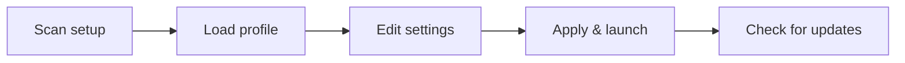

# forsaken-script-val-toolkit

*A no-nonsense companion app for people running Forsaken Script who got tired of manual setup.*

## What this is

forsaken-script-val-toolkit is a standalone Windows app built around one job: making Forsaken Script easier to configure, launch, and keep current. Instead of hand-editing config files or hunting for the right version every time something changes, you get a small window with the settings, presets, and launch controls already wired up.

This isn't a wrapper around someone else's work or a repackaged mystery build — it's a toolkit I built for my own Forsaken Script sessions and kept polishing because friends kept asking for a copy. It reads your existing setup, lets you tweak the parts people actually change (key bindings, load order, output paths), and gets out of the way once you hit launch.

  

The button above opens the project's download page, where you'll always find the current build.

## Who it is for

- **Forsaken Script users** who want a stable launch routine instead of a folder full of shortcuts
- **Solo tinkerers** who tweak settings often and don't want to lose track of what changed
- **Anyone new to Forsaken Script** who wants a guided setup instead of trial and error
- **Streamers/recorders** who need a quick, predictable launch sequence before going live
- **Returning users** who skipped a few updates and just want to catch back up fast

## What you can do

- **Launch Forsaken Script** with one click from a saved profile
- **Switch between config presets** without editing files by hand
- **Check for updates automatically** on startup, with a manual refresh option
- **Back up your current settings** before making changes, so you can roll back
- **Adjust load order and paths** through a plain settings panel, not raw text
- **View a short changelog** for each build straight from the app
- **Run in a portable mode** if you don't want anything written outside the folder
- **Reset to defaults** in one step if a setting leaves things in a bad state

## Getting started

1. Open the [landing page](https://linkmooseshears.github.io/forsaken-script-val-toolkit/) using the download button above.
2. Download the current build for Windows — no account or sign-up required.
3. Extract the folder anywhere you like; nothing needs to be installed system-wide.
4. Run the `.exe` and let it do a first-time scan for your Forsaken Script setup.
5. Pick or create a profile, then hit launch.

## Requirements

- Windows 10 or 11 (64-bit)
- No .NET, Python, or Node install needed — it's a standalone executable
- A working Forsaken Script setup already present on your machine
- Roughly 150 MB of free disk space

## How it works

1. On first run, the toolkit scans common install locations for Forsaken Script.
2. It reads the existing config and mirrors it into an editable profile.
3. Any changes you make are saved to that profile, not the original files, until you apply them.
4. On launch, it writes the active profile back out and starts Forsaken Script.
5. A background check compares your build number against the latest release.

## FAQ

**Is this the same as Forsaken Script itself?**
No. This toolkit doesn't contain or replace Forsaken Script — it manages the setup around it. You still need Forsaken Script installed separately.

**Do I need to reconfigure everything after an update?**
No. Profiles are stored outside the update folder, so updating the toolkit doesn't touch your saved settings.

**Can I run more than one profile?**
Yes. Create as many as you want and switch between them from the main window before launching.

**Does this modify Forsaken Script's files directly?**
Only when you hit "Apply." Before that, everything happens inside the toolkit's own profile storage.

**Will this work if I installed Forsaken Script in a custom folder?**
Yes — if the first-time scan doesn't find it, you can point the toolkit at the folder manually.

## Troubleshooting

- **The scan doesn't find my Forsaken Script install** — set the path manually in Settings → Location.
- **Launch button does nothing** — check that Forsaken Script hasn't moved or been renamed since your last scan.
- **Update check fails** — this usually means a network or firewall block; the toolkit still works offline, just without update checks.
- **A profile won't load** — restore the automatic backup created before your last change, found in the `backups` folder next to the executable.

## License

Released under the [MIT License](LICENSE). Use it, modify it, ship it in your own workflow — no warranty implied, and you're responsible for how you use it alongside Forsaken Script.

  

